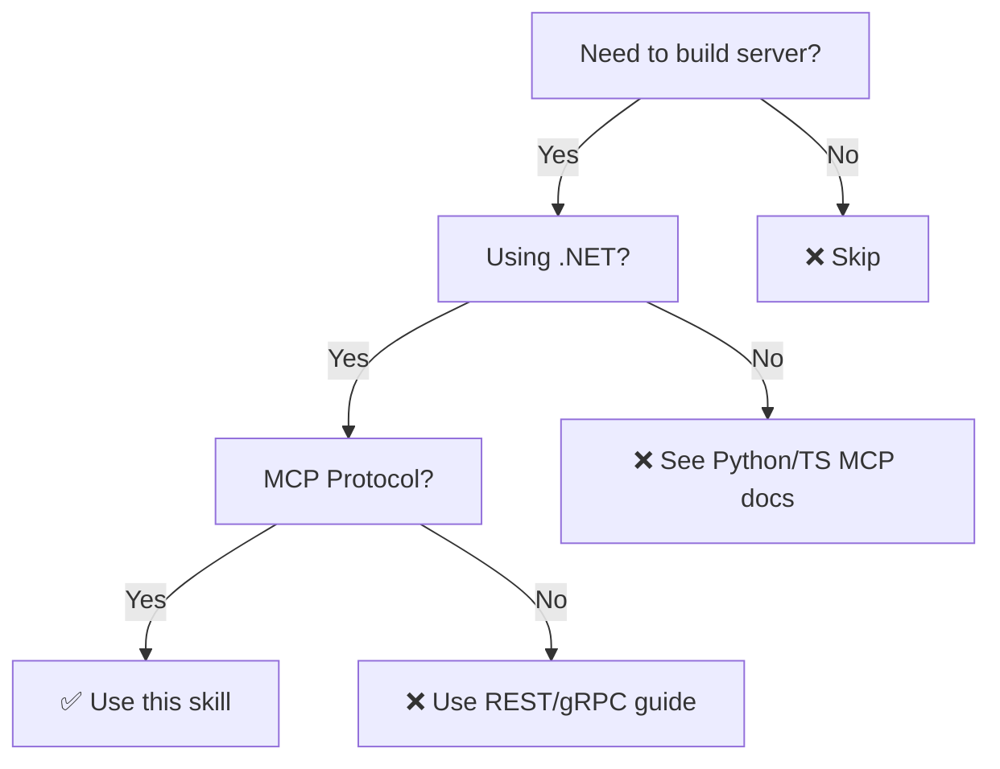

# Creating .NET MCP Servers

Build production-ready Model Context Protocol (MCP) servers in .NET with AOT compatibility.

**Core principle:** MCP servers expose tools via standardized protocol using attribute-based registration and explicit JSON serialization contexts for AOT.

## When to Use



Use this skill when:
- Building new MCP server in .NET
- Configuring SSE or stdio transport
- Enabling AOT compilation
- Need testing or error handling patterns

**Not for:** Non-.NET MCP, client-side integration, generic APIs

## Quick Reference

| Task | Implementation |
|------|----------------|
| Install packages | `dotnet add package ModelContextProtocol` + `ModelContextProtocol.AspNetCore` |
| Mark tool class | `[McpServerToolType]` |
| Mark tool method | `[McpServerTool(Name = "ToolName"), Description("...")]` |
| Parameter description | `[Description("param description")] string param` |
| Register server | `services.AddMcpServer().WithHttpTransport().WithTools<T>()` |
| Map endpoints | `app.MapMcp()` (exposes `/sse`) |
| AOT serialization | Create `JsonSerializerContext` with `[JsonSerializable]` |
| Test transport | Use `SseClientTransport` + `McpClientFactory` |

## Basic Setup

### 1. Install Packages

```bash
dotnet add package ModelContextProtocol --version 0.3.0-preview.1
dotnet add package ModelContextProtocol.AspNetCore --version 0.3.0-preview.1
# For testing (optional)
dotnet add package ModelContextProtocol.Client --version 0.3.0-preview.1
```

### 2. Enable AOT

**Project configuration:**
```xml
<PropertyGroup>
  <PublishAot>true</PublishAot>
  <JsonSerializerIsReflectionEnabledByDefault>false</JsonSerializerIsReflectionEnabledByDefault>
</PropertyGroup>
```

**JSON serialization context:**
```csharp
[JsonSerializable(typeof(PackageMetadata))]
[JsonSerializable(typeof(IEnumerable<PackageMetadata>))]
public partial class McpJsonContext : JsonSerializerContext { }
```

**Register in Program.cs:**
```csharp
builder.Services.AddMcpServer()
    .WithTools<PackageTools>(serializerOptions: McpJsonContext.Default.Options);
```

**Critical:** Add ALL tool return types to `[JsonSerializable]` attributes.

## Tool Implementation

Minimal example:

```csharp
[McpServerToolType]
public sealed class PackageTools
{
    public const string SearchPackages = "SearchPackages";
    
    [McpServerTool(Name = SearchPackages)]
    [Description("Search for NuGet packages by name or keyword")]
    public async Task<IEnumerable<PackageMetadata>> SearchAsync(
        [Description("The package name or search keyword")] string query,
        [Description("Maximum number of results (default: 10)")] int limit = 10,
        CancellationToken cancellationToken = default)
    {
        // Implementation
    }
}
```

**Key patterns:** Sealed classes, const tool names, `[Description]` on method and parameters, always accept `CancellationToken`.

## Transport Configuration

**SSE (HTTP):**
```csharp
builder.Logging.AddConsole(options => options.LogToStandardErrorThreshold = LogLevel.Trace);
builder.Services.AddMcpServer().WithHttpTransport().WithTools<PackageTools>(...);
app.MapMcp();  // Exposes /sse
```

**Stdio (CLI):**
```csharp
builder.Services.AddMcpServer().WithStdioTransport().WithTools<PackageTools>(...);
// No MapMcp() needed
```

## Testing and Error Handling

**📖 See references:**
- [Testing MCP servers](references/testing.md) - Integration tests, fixtures, Testcontainers
- [Error handling patterns](references/error-handling.md) - Structured errors, error codes, logging

## Common Mistakes

| Mistake | Fix |
|---------|-----|
| Forgot `[JsonSerializable]` for return type | Add all tool return types to `JsonSerializerContext` |
| Not logging to stderr | Set `LogToStandardErrorThreshold = LogLevel.Trace` |
| Missing `CancellationToken` | Always add `CancellationToken` parameter |
| Throwing exceptions in tools | Return `ToolResult<T>` with structured errors |
| Magic strings for tool names | Use `const string` in tool class |
| No `[Description]` on parameters | Add `[Description]` to all parameters |
| Forgetting `MapMcp()` | Required for HTTP/SSE transport |

## References

- **📖 [Testing](references/testing.md)** - WebApplicationFactory, fixtures, Testcontainers
- **📖 [Error Handling](references/error-handling.md)** - Structured errors, error codes
- **📖 [Advanced Topics](references/advanced.md)** - Clean Architecture, deployment, monitoring
- [MCP Specification](https://modelcontextprotocol.io/docs)
- [ModelContextProtocol NuGet](https://www.nuget.org/packages/ModelContextProtocol)
